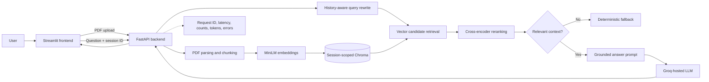
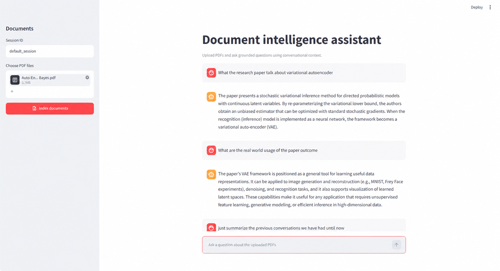

# Conversational RAG for PDF documents

A small full-stack retrieval-augmented generation (RAG) application for uploading PDFs and asking conversational questions about their contents. The project deliberately prioritizes a clear, explainable retrieval pipeline over a large feature set.

The current implementation includes PDF ingestion, configurable chunking, local embeddings, session-isolated vector retrieval, cross-encoder reranking, conversation-aware query rewriting, deterministic no-context guardrails, structured request observability, a Streamlit interface, and separate backend/frontend containers.

## Quick start with Docker

### Prerequisites

- Docker Desktop with Docker Compose
- A [Groq API key](https://console.groq.com/keys)
- Enough disk space for the Python images, PyTorch, and Hugging Face models

Copy the example configuration:

```powershell
Copy-Item .env.example .env
```

Set at least this value in `.env`:

```dotenv
GROQ_API_KEY=your-groq-api-key
```

Build and start both services:

```powershell
docker compose up --build
```

Open:

- Streamlit application: <http://localhost:8501>
- FastAPI documentation: <http://localhost:8000/docs>
- Backend health check: <http://localhost:8000/health>

Stop the services with `docker compose down`. The named `huggingface_cache` volume is retained so models do not need to be downloaded after every restart.

The first startup can be slow because the embedding model is loaded when the backend starts. The cross-encoder is loaded lazily on the first retrieval request.

## Local setup

Python 3.11 is recommended. Create and activate a Conda environment:

```powershell
conda create --name conversational-rag python=3.11 -y
conda activate conversational-rag
python -m pip install --upgrade pip
python -m pip install -r requirements.txt
Copy-Item .env.example .env
```

Add `GROQ_API_KEY` to `.env`, then start the backend and frontend in separate terminals:

```powershell
python RAG_serve.py
```

```powershell
streamlit run RAG_client.py
```

The client defaults to `http://127.0.0.1:8000`. Set `API_BASE_URL` only when the backend is hosted elsewhere.

## Using the application

1. Enter a session ID in the sidebar.
2. Select one or more text-based PDF files.
3. Choose **Index documents**.
4. Ask questions in the chat input.
5. Ask follow-up questions in the same session to use conversation history.

Scanned PDFs require OCR, which is not implemented. Uploaded documents, vector indexes, and chat history currently live only in backend memory and are lost when that process restarts.

## Architecture overview



The backend separates API routing, configuration, ingestion, retrieval, conversation state, guardrails, RAG orchestration, and observability. See [Architecture and engineering decisions](docs/architecture.md) for the request flows and design rationale.

## RAG and LLM approach

| Area | Final choice | Why |
|---|---|---|
| LLM | `openai/gpt-oss-20b` through Groq | Low-latency hosted inference and a simple OpenAI-style chat abstraction. The model is configurable rather than coupled to the chain. |
| Embeddings | `all-MiniLM-L6-v2` through Hugging Face | Small enough for local CPU use, fast for a demo, and avoids paying for embedding API calls. |
| Vector store | Chroma, in memory and isolated by session | Minimal operational setup and a good fit for a single-process prototype. |
| Chunking | Recursive character splitting, 1,000 characters with 150 overlap | A simple content-agnostic baseline that preserves some boundary context. Both values are configurable. |
| Retrieval | Eight vector candidates, then top four after cross-encoder reranking | Bi-encoder retrieval is fast; a cross-encoder gives a more precise second-stage relevance signal. |
| Reranker | `cross-encoder/ms-marco-MiniLM-L6-v2` | A relatively small local relevance model that improves ordering without another hosted dependency. |
| Orchestration | LangChain and LangServe | Provides composable runnables, history-aware retrieval, message history, and an API contract with limited glue code. |
| Conversation context | Rewrite follow-up questions into standalone queries; retain per-session chat messages | Retrieval should search for the resolved meaning of a follow-up, while the answer prompt still sees recent conversation state. |
| Grounding | Retrieve first; skip answer generation when no context survives retrieval/reranking | The failure path is deterministic and avoids spending an LLM call on unsupported questions. |

The answer prompt instructs the model to use only retrieved context, admit when the answer is absent, and respond in at most three concise sentences. Retrieved chunks are currently combined with a standard “stuff” chain because the selected top-k is small. For much larger contexts I would add token-budgeted context selection or compression.

## Quality and observability

Implemented quality controls:

- Session-scoped retrieval prevents one user's uploaded content from being searched by another session ID within the same process.
- Vector candidate retrieval is followed by cross-encoder reranking and a configurable reranker threshold.
- Empty retrieval results take a deterministic fallback branch: `I couldn't find this in the uploaded documents.`
- PDF type, empty content, session IDs, and configuration values receive basic validation.
- Prompts constrain answers to retrieved context and limit verbosity.

Each HTTP request produces a structured JSON completion log. Where applicable it includes request ID, total duration, retrieval latency, LLM latency, number of retrieved documents, LLM calls, provider token usage, response status, and an error summary. The request ID is also returned in the `X-Request-ID` header and a valid caller-supplied ID is preserved.

What is deliberately missing is equally important: there is no automated RAG evaluation dataset, no answer-level citation UI, no semantic tracing system, and no production metrics exporter. Retrieval scores and metadata exist internally but are not exposed to users.

## Key technical decisions

- **Separate frontend and backend services.** Streamlit is only an API client; model loading and document state remain in FastAPI. This makes independent deployment and scaling possible later.
- **Keep document state in memory for the assignment.** This makes the behavior easy to inspect and run, but it is not durable and prevents safe horizontal backend scaling.
- **Use a two-stage retriever.** Retrieving a wider candidate set cheaply and reranking it precisely is a better quality/latency compromise than sending many weakly related chunks to the LLM.
- **Load the reranker lazily.** Startup does not pay for the cross-encoder until retrieval actually needs it.
- **Use a deterministic guardrail before generation.** When retrieval returns nothing, the application does not ask the model to improvise an answer.
- **Keep citations out of the current UI.** Page, filename, chunk index, and scores are captured as metadata, but rendering citations was deferred to keep the basic application focused. A later version can expose that metadata without redesigning ingestion.
- **Use environment-backed configuration.** Model and retrieval choices can be tested without source edits; secrets stay in `.env`, which is excluded from Git and Docker image contexts.

## Engineering standards

Standards followed:

- Small services with explicit responsibilities and dependency injection from the application factory
- Typed configuration, response models, and key method signatures
- Input validation and safe filename handling
- Thread locks around shared in-memory vector and conversation state
- Temporary upload directories that are automatically cleaned up
- Structured logs and correlation IDs
- Environment-based secrets and configuration with a committed `.env.example`
- Separate dependency sets and Dockerfiles for frontend and backend
- Container health checks and a persistent model-cache volume
- Compatibility entry point retained for existing local commands

Standards deferred:

- Automated unit, integration, and end-to-end test suites
- Locked dependency resolution and automated vulnerability scanning
- CI checks for formatting, linting, type checking, tests, and container builds
- Authentication, authorization, quotas, malware scanning, and upload-size limits
- Database migrations, durable object storage, backups, and disaster recovery
- Formal API versioning and deprecation policy

These omissions are acceptable for a time-boxed prototype, but I would not call the current system production-ready.

## Productionization and hyperscaler deployment

The main redesign is to remove state from the FastAPI process. PDFs should go to object storage, metadata and chat state to a database, and embeddings to a durable vector index. Ingestion should become an asynchronous job so large documents do not occupy an API worker.

A cloud-neutral target would contain:

- CDN/WAF and managed ingress in front of independently scaled frontend and API services
- OIDC authentication and tenant IDs enforced at every storage and retrieval boundary
- Object storage for original documents and derived artifacts
- A queue plus autoscaled ingestion workers for parsing, OCR, chunking, embedding, and indexing
- PostgreSQL for users, sessions, document status, and audit metadata
- pgvector, OpenSearch, or a managed vector service for durable tenant-filtered retrieval
- Redis or a database-backed LangGraph/LangChain history store instead of process memory
- A secrets manager and workload identity instead of static cloud credentials
- OpenTelemetry traces, metrics, centralized logs, dashboards, alerts, and model cost budgets
- Infrastructure as code, CI/CD, image scanning, non-root containers, private networking, backups, and multi-environment promotion

Example mappings are documented in [Architecture and engineering decisions](docs/architecture.md#productionization-and-cloud-mapping). Cloudflare can host the static/edge portions and security layer, but the current Python/PyTorch inference components are a more natural fit for container or GPU/CPU compute services unless they are replaced by hosted inference APIs.

## AI-assisted development

AI coding assistance was used as a pair-programming tool to review the initial two-file prototype, propose milestone-sized refactors, generate candidate code changes, and help check dependency and container configuration. I kept the changes incremental and ran local syntax/configuration checks after edits.

I treated generated suggestions as drafts rather than requirements. Decisions such as retaining a simple UI, postponing citations, using deterministic no-context behavior, separating backend responsibilities, and documenting in-memory limitations were made by comparing the assignment scope with the cost and explainability of each feature. Before submitting, I would personally verify every command, diagram, trade-off, and claim in this document because I need to be able to defend those decisions in a technical discussion.

## What I would do with more time

In priority order:

1. Add a focused automated test suite:
   - Ingestion unit tests covering PDF validation, metadata enrichment, empty/extraction-failure handling, and temporary-file cleanup
   - Chunking tests covering chunk size, overlap, page metadata, chunk indexes, and boundary cases
   - API tests for upload, document listing, history, health, LangServe invocation, validation failures, and request IDs
   - Retrieval, reranking, session-isolation, conversation-history, and guardrail branch tests
   - A small number of browser-level end-to-end tests for the main upload-and-chat journey
2. Build a basic labelled RAG evaluation dataset from representative PDFs, including answerable questions, unanswerable questions, and conversational follow-ups. Track retrieval recall@k, ranking quality, groundedness, answer correctness, refusal accuracy, latency, and cost.
3. Add citations containing filename, page number, and a short retrieved excerpt; make supporting evidence inspectable without cluttering the main answer.
4. Improve the UI with document/session management, clearer indexing and error states, source inspection, streamed responses, better mobile behavior, and accessible interaction feedback.
5. Add durable object/vector/chat storage and asynchronous ingestion with visible job status.
6. Add OCR, table extraction, duplicate detection, upload limits, and document deletion/lifecycle controls.
7. Add hybrid lexical/vector retrieval and compare it with the current reranker using the evaluation dataset before adopting it.
8. Add authentication, tenant-aware authorization, rate limits, abuse controls, and prompt-injection/content scanning.
9. Add CI/CD, dependency locks, security scanning, OpenTelemetry, dashboards, and cloud infrastructure as code.
10. Add cancellation and explicit timeouts for long-running requests; response streaming is included in the UI improvement milestone.

## Screenshots and demo video

Repository screenshots belong in [`docs/screenshots/`](docs/screenshots/README.md). The capture checklist covers the upload state, a grounded answer, the no-context guardrail, and backend API documentation. A short demo video is optional; if recorded, it should show the same flow in under two minutes and should not expose API keys or other secrets.

### Grounded conversational answer

The screenshot below shows an uploaded research paper, an initial document question, and a conversational follow-up answered in the same session.



## Repository structure

```text
.
├── backend/
│   ├── api/                 # Upload, document, and history routes
│   ├── core/                # Configuration and logging
│   ├── models/              # Typed API responses
│   ├── services/            # Ingestion, retrieval, RAG, guardrails, state, metrics
│   ├── Dockerfile
│   └── main.py              # FastAPI application factory
├── docs/
│   ├── architecture.md
│   └── screenshots/
├── frontend/Dockerfile
├── RAG_client.py            # Streamlit client
├── RAG_serve.py             # Local backend compatibility entry point
├── docker-compose.yml
├── requirements-backend.txt
├── requirements-frontend.txt
└── requirements.txt         # Complete local-development environment
```

## API summary

| Endpoint | Purpose |
|---|---|
| `POST /upload` | Upload and index one or more PDFs for a session |
| `GET /documents/{session_id}` | List documents indexed in the current process for a session |
| `POST /chain/invoke` | Invoke the conversational RAG chain through LangServe |
| `GET /history/{session_id}` | Return chat messages for a session |
| `GET /health` | Container/readiness health response |
| `GET /docs` | Interactive OpenAPI documentation |

## Current limitations

- Single-process, in-memory vector indexes, document registry, and chat history
- No authentication or true tenant boundary; session IDs are caller-provided identifiers
- Text PDFs only; no OCR or specialized table/image extraction
- Sequential upload processing and no background jobs
- No user-facing source citations
- No automated evaluation or test suite yet
- Model downloads and CPU inference can make the first request slow
- LangChain provider and model interfaces may require maintenance as dependencies evolve
