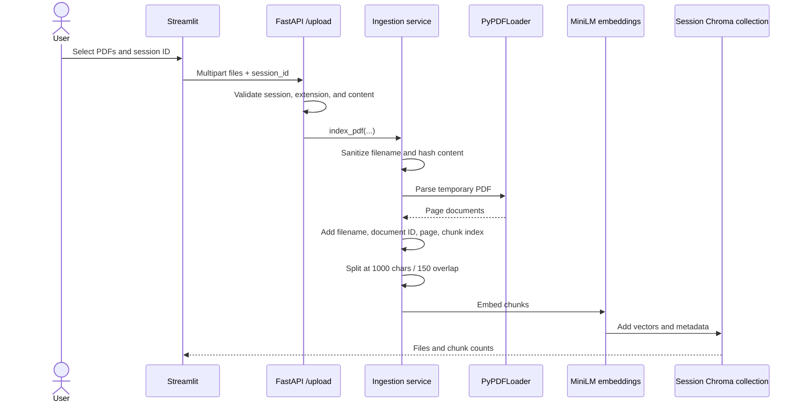
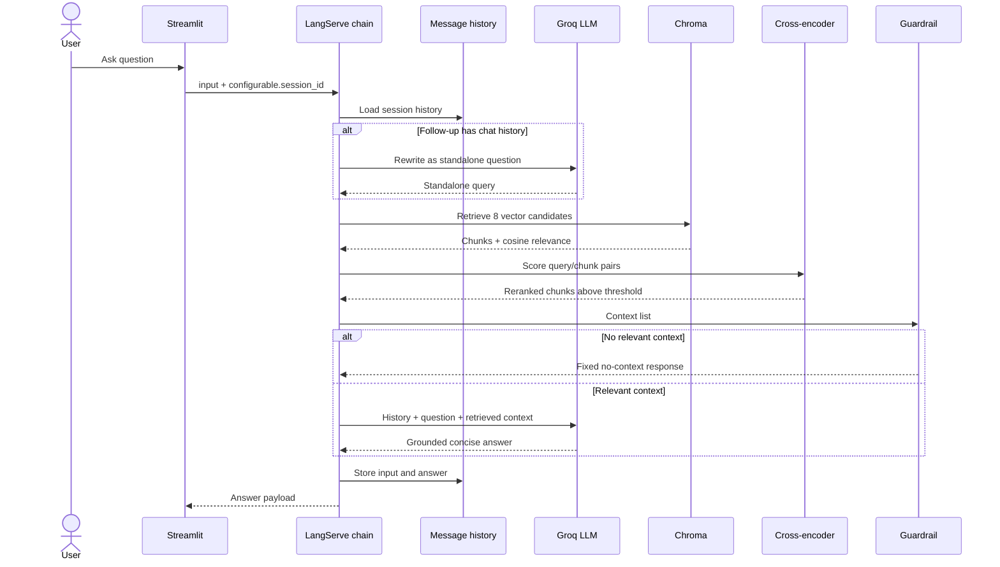
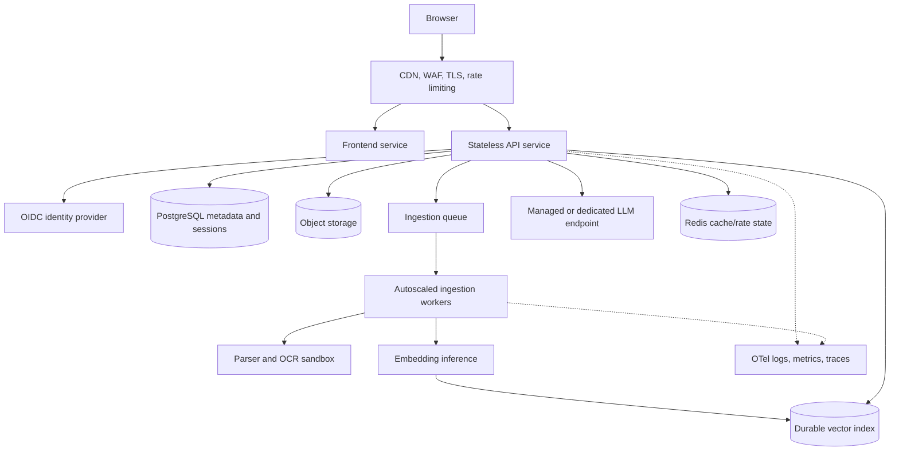

# Architecture and engineering decisions

This document expands the README with the reasoning behind the current design and a realistic path from assignment prototype to production service.

## Scope and design principles

The application answers conversational questions over PDFs uploaded during a session. The implementation optimizes for four things:

1. **Explainability:** the complete path from upload to answer is visible in a small number of focused services.
2. **Grounding:** retrieval happens before generation, and missing context causes a deterministic refusal.
3. **Local retrieval economics:** embeddings and reranking run locally; only query rewriting and answer generation use the hosted LLM.
4. **Incremental production readiness:** frontend/backend boundaries, configuration, health checks, metadata, and observability are present even though persistence and cloud infrastructure are not.

## Components

| Component | Responsibility | Current state |
|---|---|---|
| Streamlit client | Session ID, PDF selection, upload, chat rendering, API errors | Stateless with respect to backend models; browser session state stores displayed messages and uploaded-session markers |
| FastAPI application | HTTP boundary, validation, service composition, health endpoint | One process; LangServe exposes the runnable chain |
| Ingestion service | Temporary PDF storage, parsing, metadata, recursive chunking | Synchronous work executed in FastAPI's thread pool |
| Retrieval service | Embeddings, per-session Chroma collections, vector search, reranking | In-memory indexes and registry guarded by a process lock |
| Conversation service | LangChain message history per session | In-memory dictionary guarded by a process lock |
| Guardrail service | Route relevant context to generation or return a fixed fallback | Deterministic pre-generation branch |
| RAG service | Query rewriting, retrieval, answer prompt, history wiring | LangChain runnables served through LangServe |
| Observability service | Correlation ID, timings, counts, token usage, errors | Structured JSON logs scoped with `ContextVar` |

## Ingestion flow



The document ID is the first 16 hexadecimal characters of the file's SHA-256 digest. It provides stable metadata but is not currently used to reject duplicate uploads. Page numbers are normalized to one-based values when the loader supplies page metadata.

The temporary directory is deleted after parsing. This is good local hygiene, but production ingestion should place the original file in durable object storage before acknowledging the upload.

## Question-answer flow



The query-rewrite call is skipped by LangChain when no chat history exists. Therefore a first-turn grounded answer normally uses one LLM call, a follow-up can use two, and a no-context request avoids the answer-generation call after retrieval.

## Retrieval and reranking

The embedding model creates one vector per chunk. Chroma uses cosine space and initially returns `RETRIEVAL_CANDIDATE_K=8` candidates. Vector scores are retained in document metadata.

When reranking is enabled, each `(query, chunk)` pair is passed to the MS MARCO MiniLM cross-encoder. Unlike independent embeddings, the cross-encoder reads the query and chunk jointly, which costs more per candidate but generally gives a better relevance ordering. Its sigmoid score is clamped to `[0, 1]`, candidates below `0.10` are removed, and at most four chunks continue to generation.

The vector threshold applies only when reranking is disabled. When reranking is enabled, the cross-encoder threshold is the final relevance gate. This distinction is intentional; the two score distributions are not interchangeable.

The current parameters are starting points, not proven optima. They should be tuned against a labelled dataset rather than by subjective inspection of a few questions.

## Prompt and context management

There are two prompts:

- The contextualization prompt turns a follow-up plus chat history into a standalone retrieval query. It explicitly says not to answer.
- The answer prompt restricts the response to retrieved context, provides a no-answer instruction, and limits the output to three sentences.

The standard LangChain “stuff” document chain concatenates the selected documents into the answer context. With a top-k of four and moderate chunks this is understandable and usually fits the model context window. Production code should calculate a token budget, reserve output and history space, remove redundant chunks, and trim or summarize old conversation turns.

Conversation history is keyed by the LangServe runnable configuration:

```json
{
  "input": {"input": "What does it say about retention?"},
  "config": {"configurable": {"session_id": "demo-session"}}
}
```

The session ID is a routing key, not an authorization mechanism.

## Guardrails and trust boundaries

Implemented guardrails are narrow and explicit:

- Invalid or absent sessions cannot retrieve a vector collection.
- Retrieval/reranking removes weak context before prompting.
- No retrieved context returns a fixed response without answer generation.
- The answer prompt says to use only document context.
- Only `.pdf` filenames are accepted, paths are reduced to their basename, and empty files are rejected.

These controls reduce accidental hallucination but do not solve adversarial prompt injection inside documents. A production threat model must treat uploaded text and user questions as untrusted data. It should add file-size/page limits, malware scanning, content classification, extraction sandboxing, tenant authorization, rate limits, model input/output policies, and tests with malicious document instructions.

## Observability design

The HTTP middleware creates or validates an `X-Request-ID`, stores request metrics in a context-local object, and emits one `request_completed` JSON log. The LLM wrapper accumulates latency, call count, and token metadata when Groq provides it. Retrieval records elapsed time and final document count. Exceptions are recorded and unhandled exceptions include a stack trace in server logs.

This is intentionally lightweight and useful during local development. Production observability should export OpenTelemetry spans and metrics, connect the request ID to queue jobs and model calls, redact document/user content, separate availability SLOs from model-quality metrics, and alert on latency, errors, empty-retrieval rates, token cost, queue depth, and ingestion failures.

## Alternatives considered

### LLM provider

- **Chosen: Groq-hosted `openai/gpt-oss-20b`.** Good interactive latency and minimal local compute requirements.
- **OpenAI, Anthropic, Gemini, or managed cloud models.** Strong alternatives when model quality, enterprise controls, regional availability, or an existing cloud contract dominates. The LangChain boundary makes replacement possible, although outputs and token metadata must be re-tested.
- **Fully local generation.** Better data control and offline operation, but it needs substantially more memory/compute and adds model-serving operations that are outside this assignment.

### Embeddings

- **Chosen: local `all-MiniLM-L6-v2`.** Small, inexpensive, and adequate for an English-language prototype.
- **Hosted embeddings.** Easier fleet management and potentially better quality, but introduce cost, network latency, and data-governance questions.
- **Larger local or domain-specific embeddings.** Worth evaluating for multilingual or specialist corpora, but not justified without a benchmark.

### Vector storage

- **Chosen: Chroma in memory.** Near-zero setup and simple session collections.
- **FAISS.** Fast local similarity search, but metadata filtering and durable multi-user service behavior require more surrounding code.
- **pgvector.** My default production starting point when PostgreSQL already owns application metadata; transactions, backups, and tenant filters simplify operations at moderate scale.
- **OpenSearch or a managed vector database.** Attractive for hybrid retrieval or very large workloads, but operationally heavier and unnecessary for the prototype.

### Orchestration

- **Chosen: LangChain/LangServe.** Existing history-aware retrieval and composable runnable primitives reduced custom plumbing.
- **Direct SDK calls.** Fewer abstractions and easier debugging for a very small pipeline, but more manual handling of history and composition.
- **LangGraph or another workflow engine.** Better for durable, branching, stateful workflows; the current two-branch chain is too small to justify it.

### Retrieval strategy

- **Chosen: dense retrieval followed by cross-encoder reranking.** A strong quality/complexity compromise.
- **Dense retrieval only.** Faster and simpler, but ranking quality was the explicit improvement target.
- **Hybrid BM25 plus vectors.** Likely better for exact identifiers, names, and uncommon terms. It should be adopted only after comparison on the evaluation set.

## Productionization and cloud mapping

### Target architecture



### Required changes

1. **Identity and tenancy:** authenticate with OIDC; derive tenant/user IDs from signed claims; include tenant filters in every database, object, and vector operation. Never trust a caller-provided session ID as ownership proof.
2. **Durable state:** put PDFs in versioned object storage; documents, jobs, and sessions in PostgreSQL; vectors in pgvector/OpenSearch/a managed service; chat history in PostgreSQL or Redis with expiry.
3. **Asynchronous ingestion:** return a job ID, enqueue work, make each step idempotent, record progress, retry transient failures, and route permanent failures to a dead-letter queue.
4. **Horizontal scale:** keep API replicas stateless; use autoscaling based on latency/concurrency and worker queue depth. Separate CPU-heavy parsing/reranking from request-serving if needed.
5. **Security:** private networking, workload identities, secret rotation, encryption, WAF rules, malware scanning, sandboxed parsers, egress controls, signed object URLs, audit trails, and deletion/retention policies.
6. **Reliability:** timeouts, retries with jitter only for safe operations, circuit breakers, idempotency keys, multi-zone databases, backups, restore tests, and graceful degradation when model providers fail.
7. **Delivery:** infrastructure as code, pinned images/dependencies, SBOM and image scanning, CI quality gates, staged deployments, canaries, rollback, and separate development/staging/production accounts.
8. **Model quality operations:** version prompts/models/indexes, maintain offline evaluation sets, run regression gates, sample production feedback, and monitor retrieval/grounding drift.

### Hyperscaler examples

| Capability | AWS | GCP | Azure | Cloudflare role |
|---|---|---|---|---|
| Containers | ECS/Fargate or EKS | Cloud Run or GKE | Container Apps or AKS | Containers are not the primary fit for this Python/PyTorch backend |
| Object storage | S3 | Cloud Storage | Blob Storage | R2 |
| Queue | SQS | Pub/Sub | Service Bus | Queues |
| Relational/vector | RDS PostgreSQL + pgvector or OpenSearch | Cloud SQL/AlloyDB + pgvector or Vertex AI Vector Search | Azure Database for PostgreSQL + pgvector or Azure AI Search | External DB, D1 for smaller metadata workloads, or Vectorize after evaluation |
| Secrets/identity | Secrets Manager + IAM | Secret Manager + IAM | Key Vault + Managed Identity | Secrets + service bindings |
| LLM | Bedrock or external Groq | Vertex AI or external Groq | Azure AI Foundry/OpenAI or external Groq | Workers AI if model/quality requirements fit |
| Observability | CloudWatch + X-Ray/OTel | Cloud Logging/Monitoring/Trace | Azure Monitor/Application Insights | Analytics/Logpush plus an OTel backend |
| Edge security | CloudFront + WAF | Cloud CDN + Cloud Armor | Front Door + WAF | CDN, WAF, Turnstile, rate limiting, Access |

This table shows plausible mappings, not a recommendation to use every service. I would select one cloud, prefer managed primitives already understood by the operating team, and load-test the simplest architecture before introducing Kubernetes.

## Scaling constraints in the current code

- A second backend replica would have a different vector index and chat-history dictionary.
- Restarting the process loses every uploaded document and conversation.
- Uploads are processed sequentially per request and embedding work consumes backend CPU.
- The process lock protects shared Python structures but can reduce concurrency during vector operations.
- Model memory is duplicated in every backend replica.
- The frontend's `uploaded_sessions` flag is browser-session state and is not authoritative.

These are architectural constraints, not configuration problems; increasing the replica count alone would make behavior inconsistent.

## Quality evaluation plan

Before changing models or thresholds, create a versioned dataset containing document IDs, questions, expected supporting pages/chunks, acceptable answers, unanswerable questions, and conversational follow-ups. Track:

- Retrieval recall@k and mean reciprocal rank
- Reranker precision/recall at the selected threshold
- Answer correctness and groundedness
- Citation correctness after citations are added
- Correct refusal rate for unanswerable questions
- P50/P95 ingestion, retrieval, and answer latency
- Tokens and hosted-model cost per answered question

Run the dataset whenever the embedding model, chunking, retrieval parameters, reranker, prompt, or LLM changes. Human review remains necessary for failure analysis and for validating that automated judges are not masking systematic errors.

## Decision record and deferred work

This repository intentionally stops at a coherent prototype boundary. It does not simulate production with a collection of unused abstractions. The next meaningful milestones are tests and evaluation, then durable/asynchronous ingestion, then citations and security—not additional agents or elaborate orchestration.

